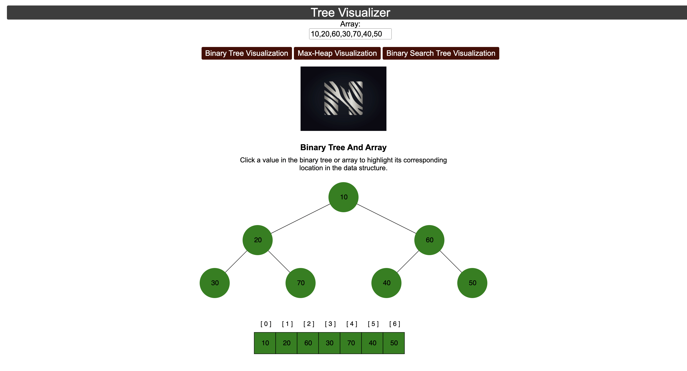

# Tree-Visualizer

</img>

Live Demo:https://tree-visualizer-3ol0un9pq-nikhil991gupta.vercel.app/
a framework for dynamically visualizing binary trees and arrays on a webpage, facilitating interactive exploration and understanding of these data structures.

# app.js

This JavaScript code is designed to facilitate the visualization of binary trees and arrays based on user input. It provides several functions to manipulate and display these data structures dynamically on a web page.

Firstly, the reset() function is responsible for clearing any existing visualizations from the page, ensuring a clean slate for new data.

The treeAndArray() function processes user input provided in an input field, interpreting it as an array. It then generates a binary tree representation and visually displays both the binary tree and the corresponding array on the webpage.

Similarly, the heapify() function processes user input to create a max-heap data structure. It visualizes this heap structure alongside the input array, with updated instructions and titles to reflect the change.

The createBinaryTreeAndArr(arr) function is a utility function that generates visual representations of both a binary tree and an array based on the provided input array.

Lastly, the createBinarySearchTree() function arranges the input data into a sorted array and visualizes it as a binary search tree.

By default, the code initializes with a predefined input array [10, 20, 60, 30, 70, 40, 50], populating the input field and visualizing the corresponding binary tree and array on the webpage. This setup serves as an initial demonstration of the visualization capabilities of the code.

# heap.js
mplements functions to convert an array into a max-heap and perform reheapification downwards. Here's a concise breakdown:

swap(arr, a, b): Swaps elements at indices a and b within the array arr.
parent(index): Returns the index of the parent node of the element at the given index.
leftChild(index): Returns the index of the left child node of the element at the given index.
rightChild(index): Returns the index of the right child node of the element at the given index.
The main functions are:

makeHeap(arr): Converts the input array into a max-heap by iteratively swapping elements upwards if they violate the max-heap property.
reheapifyDown(arr, length): Reorganizes the heap downward from a given index to maintain the max-heap property. It iteratively swaps elements with their larger child until the element is in its correct position.
Both functions use the swap() function for element interchange, and the makeHeap() function utilizes the parent() function to navigate through the heap.

Additionally, the swaps array keeps track of indices that have been swapped during the reheapification process.

# node.js

 It defines functions to visualize binary trees, arrays, and their interactions on a webpage using D3.js. Here's a concise summary:

The code initializes various variables and constants for styling and layout purposes.
It defines a Node constructor function to create nodes for the binary tree.
The Tree constructor function manages the creation and manipulation of binary trees.
There are methods to add, update, and remove nodes from the tree, as well as functions to create binary trees and binary search trees.
Functions are provided to visualize arrays and to handle highlighting of elements.
Additional utility functions assist in setting attributes and dimensions for elements.
Finally, a function creates a container for SVG elements based on input data and dimensions.
Overall, this code provides a framework for dynamically visualizing binary trees and arrays on a webpage, facilitating interactive exploration and understanding of these data structures.

